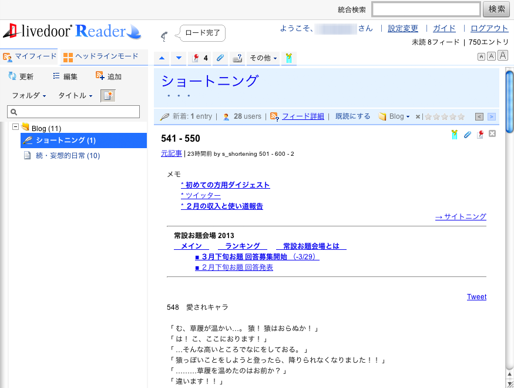
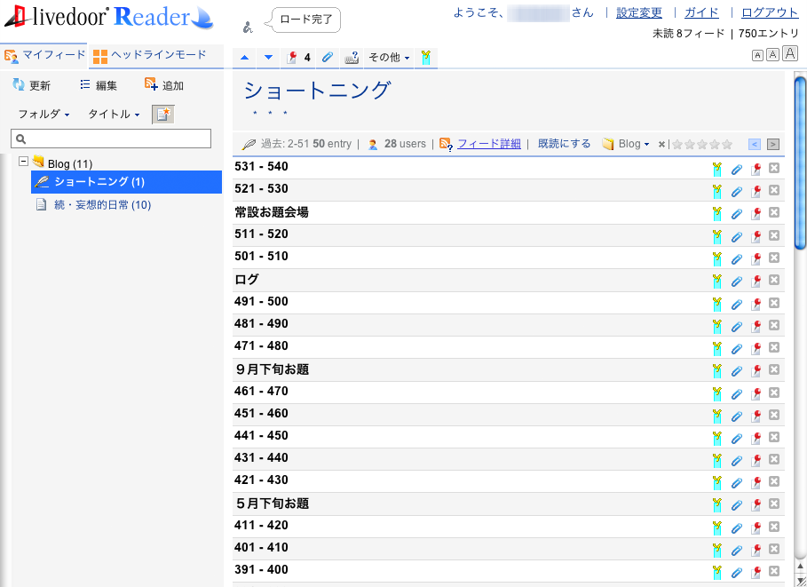

# G2L custom
Livedoor ReaderをちょっぴりカスタマイズするGreasemonkeyスクリプト。

## 説明
Google Reader難民としてLivedoor Readerに引っ越したものの、ちょっと不満があったので、Greasemonkeyスクリプトで一部解消してみました。内容は以下の通りです。よろしくお願いいたします。

- デザインの微調整
- ヘッダーを一段階非表示に
- 本文を最初から非表示に
- 本文非表示時のコンパクト化
- 既読コマンドにキー割り当て

## スクリーンショット
- 通常時  

- 適用時  

- 本文非表示＆通常時  

- 本文非表示＆適用時  


## 要件
- 要Greasemonkey（ChromeならTampermonkey）
- Safariはよく分かりませんが、グリモンスクリプト動くならいけるかもしれません。

## 設定
### 機能の選択
デザイン微調整、コンパクト化、既読キーバインドの3つに分けてますので、どれかが不要であればバッサリ消して下さい。コメントが目印です。  

#### コメントとその機能
- `LDR Style`以下  
→デザイン微調整
- `compact list`以下  
→本文非表示時のコンパクト化
- `already-read keybind`以下  
→既読キーバインド

### 既読キーの変更
既読キーは`X`（大文字のX。つまり`Shift+X`）に割り当てています。変えたい場合は以下の箇所を変更してください。

#### 設定方法
スクリプト37行目の`'X'`を好きなキーに変更すればOK。

```javascript
Keybind.add('X', function(){
```


## ライセンス（License）
Copyright &copy; 2013 [tsukaguitar](http://www.rakuin.com)  
Licensed under the [MIT License][mit].


[GFM]: http://github.github.com/github-flavored-markdown/
[MIT]: http://opensource.org/licenses/mit-license.php
